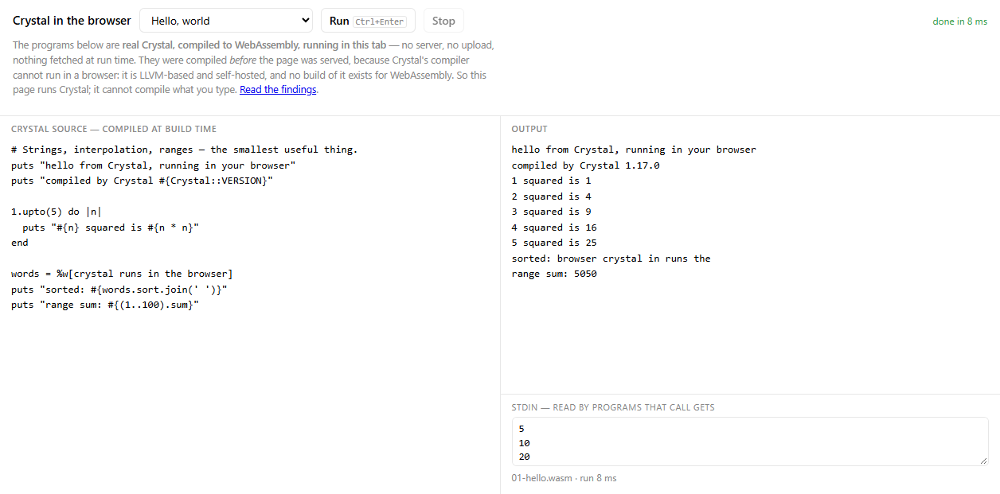

# browser-crystal

Run **real Crystal in the browser** — the programs in `samples/` are compiled to WebAssembly and
executed in the tab, with no server, no upload, and no cross-origin isolation headers.

It is a proof of concept for adding a `crystal` language to [LiveCodes](https://livecodes.io), in the
same shape as [`browser-cobol`](https://github.com/live-codes/browser-cobol) and
[`browser-nim`](https://github.com/live-codes/browser-nim) are for theirs.

**Read this before the rest:** this page *runs* Crystal; it cannot *compile* it. Crystal's compiler
is self-hosted, links LLVM and shells out to a linker, and no build of it exists for WebAssembly — so
the samples are compiled before the page is served, and the editor is read-only. That is not a
shortcut, it is the state of the ecosystem, and it means Crystal does not currently meet
LiveCodes' own "[compiler that runs client-side](https://livecodes.io/docs/contribution/adding-languages/)"
criterion. The reasoning and the evidence are in [FINDINGS.md](FINDINGS.md) §2; the short version is
that the missing piece is an upstream artifact, not an integration.

<p align="center"></p>

## Where the work stands

This page is still the original proof of concept: it *runs* precompiled Crystal and cannot
compile what you type. The effort to change that is tracked separately —

- **[HANDOFF.md](HANDOFF.md)** — current state, the environment, the exact next task, and
  everything learned the hard way. **Start here if you are picking this up.**
- [FINDINGS.md](FINDINGS.md) §9 — libLLVM built for `wasm32-wasip1`, verified.
- [FINDINGS.md](FINDINGS.md) §10 — the Crystal compiler: it builds, links, runs and reads the
  standard library; exceptions on wasm are the remaining blocker.

## Run it

```bash
npm start          # → http://localhost:8127/
npm test           # run every sample under Node's WASI
```

There is no `npm install` — the repo has no dependencies. The built modules are committed, so
`npm start` is all you need; `npm run build` (which does need Docker) recompiles them.

A static server is required — ES modules and Workers do not load over `file://` — but it is a plain
file server, and nothing is compiled by it. `serve.mjs` also sends `Content-Type: application/wasm`,
without which `WebAssembly.compileStreaming` refuses the response.

## What works

The samples are not toys; between them they exercise a real slice of the language, all of it verified
in headless Chrome with `crossOriginIsolated === false`:

| sample | covers |
| --- | --- |
| **Hello, world** | strings, interpolation, `1.upto`, ranges, `%w`, `#sum` |
| **Arrays, hashes and blocks** | `sort`/`sort_by`/`select`/`map`/`sum`, blocks, `Hash`, `each_char` |
| **Classes, structs and modules** | `struct` with `getter`, `class`, `include Module`, operator overloading, method overloading, `to_s(io)` |
| **Errors without exceptions** | `Int32?` unions, `case … when Nil`, `[]?`, `split.first?` |
| **Reading stdin** | `gets`, over WASI `fd_read`, fed by the stdin box |
| **Regular expressions** | `scan`, `gsub`, character classes — PCRE2, built for wasm |

Program output is streamed as it is produced, and the program runs in a Worker, so a page-breaking
program can be stopped by throwing the Worker away.

## What does not work

| | why |
| --- | --- |
| **Compiling what you type** | there is no Crystal compiler for WebAssembly — see [FINDINGS.md](FINDINGS.md) §2. This is the big one. |
| **Compiler diagnostics** | nothing in the page can parse Crystal, so there is nothing to report. |
| **`begin`/`rescue`/`ensure`, `raise`** | exceptions trap with `unreachable` in every build mode; Crystal has no unwinder on this target. §4 |
| **Files, clocks, threads, `fork`, subprocesses** | WASI preview 1 here has no filesystem, and only eight WASI calls are implemented at all. §5 |
| **Crystal newer than 1.17** | the wasm target does not compile on 1.21.0, the current release. §3 |
| **Memory being reclaimed** | wasm32 selects Crystal's no-GC allocator. Fine for a sample, not for a service. §1 |

## How it works

```
samples/*.cr
  → crystal build --cross-compile --target wasm32-unknown-wasi   → wasm object     (build/Dockerfile)
  → wasm-ld <object> -lc -L<wasi-sysroot> -lpcre2-8              → WASI module
  → WebAssembly.compileStreaming + public/wasi-preview1.js       → output          (in the tab)
```

Crystal's cross-compile stops at the object and *prints* the link command it would have run; the
official image ships neither `wasm-ld` nor a WASI sysroot, so `build/Dockerfile` adds `wasi-sdk` and
builds PCRE2 for wasm. Three details that are easy to get wrong are recorded in
[FINDINGS.md](FINDINGS.md) §1 — that wasm32 picks the no-GC allocator by itself, that `Regex` needs a
wasm PCRE2, and that the result is an ordinary WASI command module.

On the page side the whole host contract is **eight functions**, which is everything a Crystal
program asked for across every sample:

```
args_sizes_get  args_get  fd_fdstat_get  fd_fdstat_set_flags
fd_read  fd_write  proc_exit  random_get
```

| file | what it is |
| --- | --- |
| `public/wasi-preview1.js` | the WASI host — ~120 lines, no dependencies |
| `public/crystal-worker.js` | runs one module off the main thread |
| `public/index.html` | the page: samples, run/stop, output, stdin |
| `build/Dockerfile` | Crystal 1.17.0 + wasi-sdk 22 + PCRE2 10.42 |
| `build/build-samples.sh` | cross-compile and link, one sample at a time |
| `build/build-samples.mjs` | drives Docker and writes `public/crystal/samples.json` |

The page exposes `document.documentElement.dataset` (`status`, `stage`, `runs`, `exitCode`, `ms`,
`sample`) and its element ids as globals, so scripted checks can read state without string literals.

## Verifying

| what | command |
| --- | --- |
| run every sample (Node's WASI, not the page's) | `npm test` |
| syntax-check the server, build script and client modules | `npm run check` |
| rebuild the wasm modules | `npm run build` |
| serve the page | `npm start` → http://localhost:8127/ |

`npm test` is worth running rather than trusting: it uses Node's WASI implementation, which is a
different host from `public/wasi-preview1.js`, so it checks the artifacts themselves — and it prints
the union of WASI imports, which is what the host has to keep up with.

## Licensing and provenance

MIT for the code here, and for the Crystal standard library that ends up inside the modules
(Crystal is Apache-2.0; the compiled artifacts embed its runtime).

- **Crystal 1.17.0** — Apache-2.0 — via `crystallang/crystal:1.17.0`. Pinned deliberately; see
  [FINDINGS.md](FINDINGS.md) §3.
- **wasi-sdk 22** (`wasm-ld`, wasi-libc) — Apache-2.0 WITH LLVM-exception / MIT — for the linker and
  the sysroot the Crystal compiler does not supply.
- **PCRE2 10.42** — BSD-3-Clause — built for wasm32-wasi, for `Regex`.
- `public/wasi-preview1.js` is written here rather than vendored, so there is no third-party host
  code in the repo.

## Status

Spike complete. The runtime side is proven and small; the compiler side is blocked upstream, which is
why this is a proof of concept rather than a language module. Next steps, if it is picked up again,
are in [FINDINGS.md](FINDINGS.md) §7 — and they start with watching the two upstream signals in §3
and §2 rather than with more work here.
