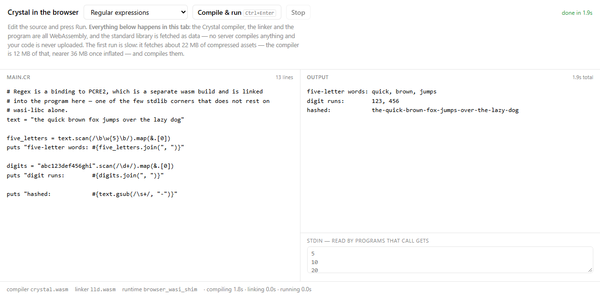

# browser-crystal

Run **real Crystal in the browser**. There is one page —
[`public/index.html`](public/index.html) — and it is the whole thing: edit Crystal, press Run, and
the toolchain runs in the tab —

```
your Crystal source
  → crystal.wasm        the Crystal compiler, built for wasm32-wasip1   → wasm object
  → lld.wasm            LLVM's linker, run as `wasm-ld`                 → WASI module
  → the module          your program                                    → output
```

No server compiles anything, nothing is uploaded, and no cross-origin isolation is required. The
standard library is fetched as data.

It began as a proof of concept for adding a `crystal` language to [LiveCodes](https://livecodes.io),
in the same shape as [`browser-cobol`](https://github.com/live-codes/browser-cobol) and
[`browser-nim`](https://github.com/live-codes/browser-nim) are for theirs — and getting there
required work that existed nowhere else:

- **a libLLVM for `wasm32-wasip1`** — Crystal links LLVM, and no wasm build of it existed to
  download. It does now: [`build/llvm-wasm/`](build/llvm-wasm/), 99 archives, verified.
- **the Crystal compiler, ported to WASI** — [`build/crystal-wasm/`](build/crystal-wasm/), with
  every source edit in one idempotent `apply-patches.py`.
- **Crystal's wasm exception handling** — Crystal 1.17 does not implement it; the fix is a small
  codegen patch plus two LLVM options the C API cannot set. See
  [build/crystal-wasm/README.md §Resolution](build/crystal-wasm/README.md#resolution--the-wasm-catch-works).

[FINDINGS.md](FINDINGS.md) is the narrative; [HANDOFF.md](HANDOFF.md) is the state of the work and
everything learned the hard way — **start there if you are picking this up**.

## Run it

```bash
npm run demo:assets   # once — build the payload (Linux or WSL; about 22 MB of assets)
npm start             # → http://localhost:8127/
```

`npm run demo:assets` collects the compiler, the linker, the standard library and the sysroot
archives into `public/crystal-demo/`, gzipped, which is gitignored — they are far too large to
commit and building them is a long pipeline whose result is reproducible. The page inflates them
itself (`DecompressionStream`), so any static host works. Without them the page loads and reports
what is missing.

A static server is required — ES modules and Workers do not load over `file://` — but it is a plain
file server and compiles nothing. `serve.mjs` sends `Content-Type: application/wasm`, without which
`WebAssembly.compileStreaming` refuses the response.

There is no `npm install`: the page has no dependencies, and the one piece of third-party host code
(the WASI shim) is vendored into `public/vendor/`.

## The demo

<p align="center"></p>

The page is an editable editor over one worker. Everything slow or unkillable happens in the worker,
so Stop throws it away and the page survives it. Eight samples ship with it, and they are compiled
by the compiler on the page like anything else you type: strings and interpolation, exceptions,
arrays/hashes/blocks, structs/classes/modules/operator overloading, `Int32?` unions and
`case … when Nil`, `gets` over `fd_read` (the stdin box), and `Regex` (PCRE2, built for wasm).

| file | what it is |
| --- | --- |
| `public/index.html` | the page: editor, Run/Stop, output, stdin box, phase timings |
| `public/demo-worker.js` | fetches and compiles the assets once, then drives a run |
| `public/crystal-demo.js` | compile → link → run, in ~200 lines; the same code runs in Node |
| `public/vendor/browser_wasi_shim/` | the WASI host, and the filesystem the compiler needs |

First run is slow — it downloads about 22 MB of gzipped assets and compiles a 35 MB wasm module —
and later runs reuse the compiled modules, so only the user's program is compiled. Measured in
headless Chrome: **4.3 s for the first run, 2.0 s after** (each of the eight samples compiles in
1.7–3.1 s). It was 16 s and 10–15 s until the WASI host's file writes were fixed: writing an object
file was quadratic. See
[build/crystal-wasm/README.md](build/crystal-wasm/README.md#where-the-compile-time-went).

The output pane is the *program's* output. The compiler's and the linker's own chatter is buffered
and not shown — Crystal echoes the link command it would have run, and lld warns about a known,
benign `_Unwind_SetIP` signature mismatch in libunwind's wasm port. A warning *about your code* and
a failed build's diagnostics still appear.

## What works

Verified in headless Chrome with `crossOriginIsolated === false`:

- **Compiling and running what you type**, in the tab — including `begin`/`rescue`/`ensure`, which
  is what the exception work was for, and a stdin box, so a program that calls `gets` reads what you
  type into it. `test/demo.mjs` checks the same code path under Node.
- **All eight samples**, which between them cover the language surface above — in particular the
  regex sample, which is the one that needs a library wasi-libc does not carry.
- Program output streams as it is produced, and programs run off the main thread.

## What does not work

| | why |
| --- | --- |
| **A small first load** | 22 MB gzipped. 12 MB of that is the compiler — the whole compiler plus the whole standard library compiled to wasm — and 7.8 MB is the linker, which is a *generic* lld (ELF, COFF, Mach-O and wasm). A wasm-only lld was built from our own LLVM source and is *not* smaller: lld's LTO support is not separable by a flag. See [build/crystal-wasm/README.md](build/crystal-wasm/README.md#a-wasm-only-lld--built-and-not-adopted). |
| **Files, clocks, threads, `fork`, subprocesses** in a *compiled program* | WASI preview 1 here has no sockets, and the demo gives a program an empty filesystem; the compiler itself has one, which is how it reads the stdlib. §5 |
| **A program that ships its own shims** | the demo links a fixed list of libraries (`libc`, `libc++abi`, `libunwind`, PCRE2, the WASI emulation archives); anything else has to be linked in by hand |
| **Memory being reclaimed** | wasm32 selects Crystal's no-GC allocator. Fine for a demo, not for a service. §1 |
| **Crystal newer than 1.17** | the wasm target does not compile on 1.21.0, the then-current release. §3 |
| **Anything needing the browser to raise its stack** | V8 gives a wasm instance ~1 MB of native stack and a page cannot raise it, so the compiler is built `--release` (optimized frames fit in 700 KB); a debug build does not. [README §Resolution](build/crystal-wasm/README.md#resolution--the-wasm-catch-works) |

## Verifying

| what | command |
| --- | --- |
| the page's compile → link → run, under Node | `npm test` |
| syntax-check the server and client modules | `npm run check` |
| rebuild the payload | `npm run demo:assets` |
| serve the page | `npm start` → http://localhost:8127/ |

`npm test` is the one that matters: the page's core has no browser-only API, so the whole chain —
including a program that raises and rescues — is checked in Node against the same assets the page
fetches. What the browser adds is asset loading and the UI.

## Layout

```
public/            the page, its worker, the compile → link → run core, and the vendored WASI host
build/llvm-wasm/   libLLVM for wasm32-wasip1 (committed output, ~140 MB, on purpose)
build/crystal-wasm/ the compiler pipeline, the payload script, and the lld/exception notes
test/demo.mjs      the Node harness for the same code the page runs
```

## Licensing and provenance

MIT for the code here, and for the Crystal standard library that ends up inside the modules
(Crystal is Apache-2.0; the compiled artifacts embed its runtime).

- **Crystal 1.17.0** — Apache-2.0 — the compiler's own source, patched by `apply-patches.py`.
- **LLVM 20.1.8** — Apache-2.0 WITH LLVM-exception — built for wasm32-wasip1 in `build/llvm-wasm/`.
- **wasi-sdk 33** (clang, wasm-ld's libraries, the sysroot) — Apache-2.0 WITH LLVM-exception / MIT.
- **PCRE2** — BSD-3-Clause — built for wasm32-wasi, for `Regex`.
- **`lld.wasm`** comes from [`clang-wasm`](https://github.com/live-codes/clang-wasm) (LLVM 22,
  Apache-2.0 WITH LLVM-exception); `build/crystal-wasm/demo-assets.sh` copies it in.
- **`@bjorn3/browser_wasi_shim`** v0.4.2 — MIT OR Apache-2.0 — vendored into `public/vendor/`, with
  its licence files, as the compiler's WASI host.

## Status

The question this repository opened with — *can Crystal's compiler run in a browser* — is answered:
it does, and the page is the proof. What is left is packaging it so LiveCodes can use it, which is
[HANDOFF.md](HANDOFF.md) §7.
